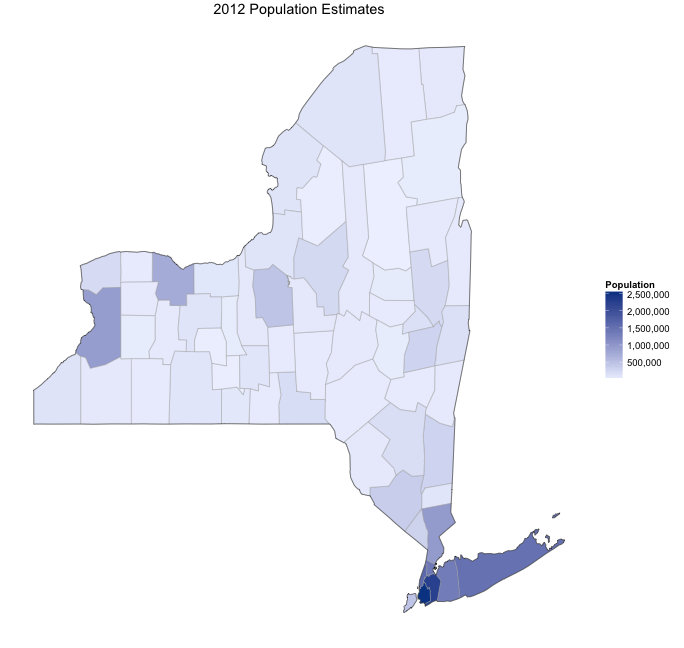
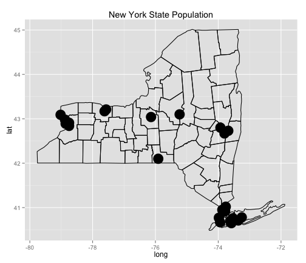
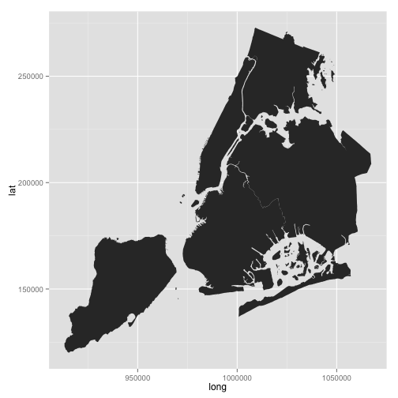
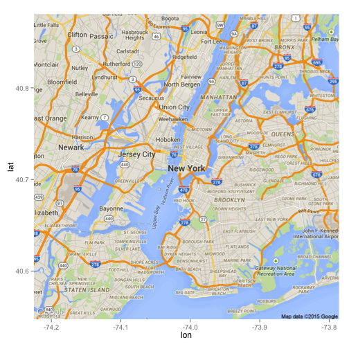
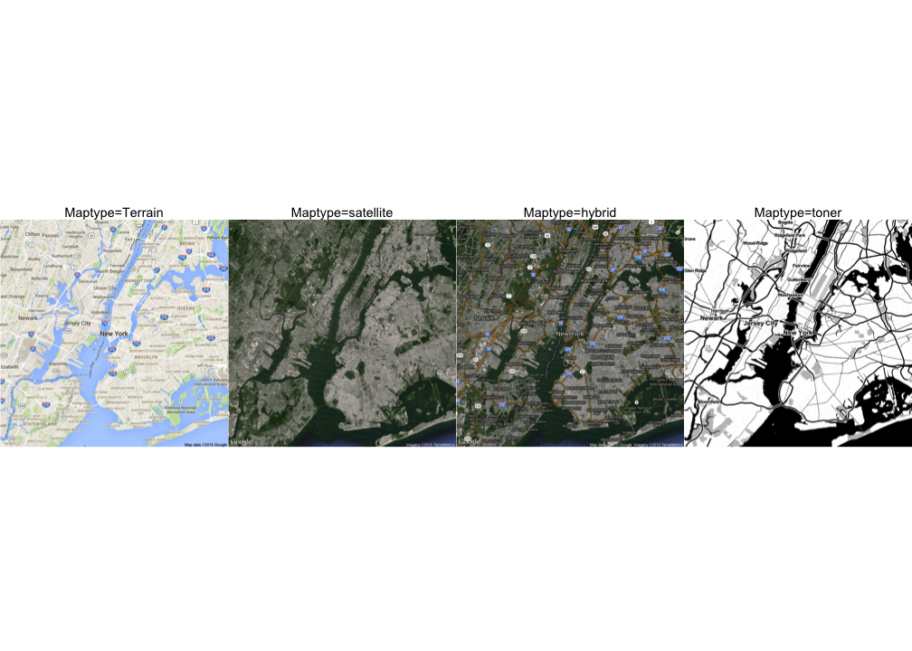
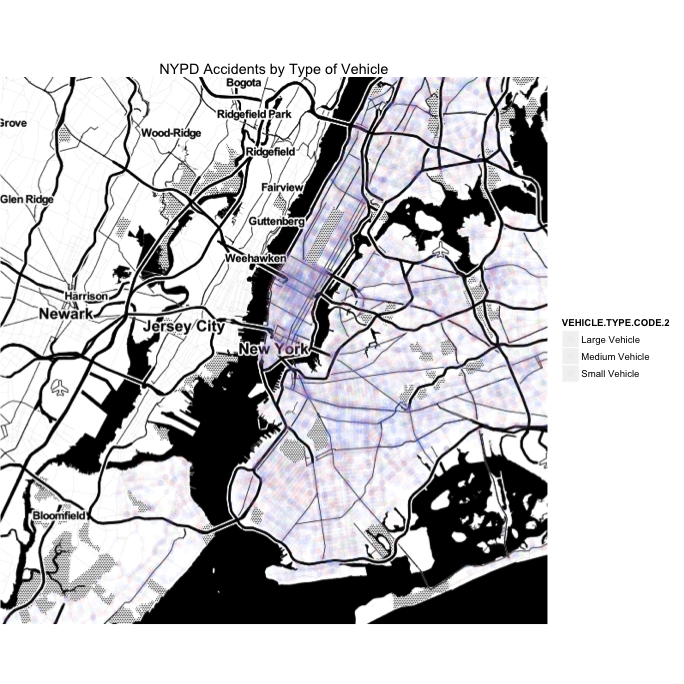

<h1>Making basic NYC maps in R</h1>

<h3>Purpose: To learn how to make a map of New York City using R</h3>

By Shiemi Lim and Emilie Bruzelius

  1. Making maps using Choropletr package
  2. Creating a map using ggplot
  3. Creating maps with shapefile
  4. Using already made maps: Maps using ggmap
  5. Making dynamic maps with Plotly
  6. Other tools: Mapbox
  7. Resources

Prerequisites: The latest R version installed. (This was created using version 3.1.2)

Lets get started. The following packages need to be installed and called. 


```r
library(ggplot2) # contains several mapping functions
library(ggmap)  # combines static maps (google, OpenStreetMap etc. with ggplot)
library(maps)  # displas maps but projection code and larger maps are in separate packages (mapproj, mapdata) 
library(scales) # functions
library(knitr) # creates dynamic reports
library(choroplethr) # creates simple choropleth maps
library(choroplethrMaps) # contains county, state and country maps used by choroplthr
library(rgdal) # reads shapefiles
library(gridExtra) # grid functions
library(devtools) # makes developing packages easier - we needed it to install plotly
library(plotly) # creates interactive maps with ggplot2 syntax 
```

<h3>1. Make a NY map using choroplethr</h2>
For the first example the following packages are necessary.


```r
library(choroplethr) 
library(choroplethrMaps)
```

Choropleths are thematic maps where geographic area are colored-coded according to some metric. The choroplethr package creates choropleths of common maps. 

Start by accessing the county.regions and df_pop_country data from the R repository.


```r
data(county.regions)
data(df_pop_county)
```

Here is a snapshot of the df_pop_county data.


```
##   region  value
## 1   1001  54590
## 2   1003 183226
## 3   1005  27469
## 4   1007  22769
## 5   1009  57466
## 6   1011  10779
```

With a few lines of code, we can create a choropleth map of NY State. The county_chorpleth function calls the county.map within the choroplethrMaps pacakge. 

Buckets refers to the number of equally sized buckets to place the values in. A value of 1 will use the continuous scale, and a value in [2,9] will use that many buckets. Zoom is the vector of the state to zoom in on. In order to work, the name specified must exactly match the names of regions as they appear in the "region" column.


```r
county_choropleth(df_pop_county,
                  title   = "2012 Population Estimates",
                  legend  = "Population",
                  buckets = 1,
                  zoom    = c("new york"))
```

 

This map shows population level by county in New York State. As you can see, population is highly concentrated in the New York City region. 

Now that we've made a choropleth map we want to try to plot specific points on a map of New York. To do this we're going to use ggplot2.
<p><p>

<h3>2. Creating a map using ggplot</h3>
Using ggplot, we can also create a quick plot using the qplot function. In this example we're again looking at population size but we want to visualize population by city. 
<p>

Access the data us.cities from the R repository. 


```r
data(us.cities)
```

Here is a snapshot of the data:


```r
head(us.cities)
```

```
##         name country.etc    pop   lat    long capital
## 1 Abilene TX          TX 113888 32.45  -99.74       0
## 2   Akron OH          OH 206634 41.08  -81.52       0
## 3 Alameda CA          CA  70069 37.77 -122.26       0
## 4  Albany GA          GA  75510 31.58  -84.18       0
## 5  Albany NY          NY  93576 42.67  -73.80       2
## 6  Albany OR          OR  45535 44.62 -123.09       0
```

With a few lines, we can make a plot of NY. 


```r
ny <- subset(us.cities, country.etc == "NY")
plot2<-ggplot(ny, aes(long, lat)) +
  borders("county", "New York", colour="black") +
  geom_point(size = 8) +
  labs(title="New York State Population")
plot2
```

 

From this example we can see the population size in major cities including Albany and Buffalo. Again, it shows the county-level distinctions. 

But we're really interested in looking specfically at New York City not New York State. Here's where shapefiles come in. 
 
<h2>3. Creating a NYC map using shapefiles</h2>

A shapefile is a nontopological format for storing the geometric location and attribute information of geographic features. Geographic features in a shapefile can be represented by points, lines, or polygons (areas). The term shapefile can be slighltly misleading as it is really referring to a collection of files that stores the actual geometry as well as attributes assisgned to that information. 

In the example above we wanted to make a map of New York City, but we couldn't zoom down to the level of the city. We were stuck with the whole of New York State. 

For New York City-related spatial data one of the best sources of information is the NYC Department of Planning who maintain the Bytes of the Big Apple site. There, you can download a host of different shapefiles including borough maps, congressional districts, waterline maps etc. Note that at the end of this tuorial we included a set of resources for accessing other kinds of spatial data. In this current example we're using a basic NYC shapefile that includes outlines of each borough. 

The first step is to load the package that will read the shapefile. 


```r
  library(rgdal)
```

There are a few packages that will read shapefiles. We're using the readOGR function in the rgdal package. You can also use readShapePoly readShapePoints etc. in maptools. From our digging around, it seems like readOGR is often a better bet than some of the other functions because it preserves the map's projection information. 

Initially, we had some trouble accessing the rgdal (and also rgeoms) packages in R version 3.1.2. We were finally able to download the DMG from <a href="http://www.kyngchaos.com/software/frameworks/" target="_blank">kyngchaos</a> and install the package from the included .tgz file.


```r
  counties<-readOGR("nybb.shp", layer="nybb")
```

```
## OGR data source with driver: ESRI Shapefile 
## Source: "nybb.shp", layer: "nybb"
## with 5 features and 4 fields
## Feature type: wkbMultiPolygon with 2 dimensions
```

We can now plot a simple map of NYC that shows each of the boroughs. 


```r
ggplot() +  geom_polygon(data=counties, aes(x=long, y=lat, group=group))
```

 

Now, if we want to plot some other data on this map we can do it fairly easily. We're using the NYPD stop and frisk data for 2013.  

<a href="hhttps://raw.githubusercontent.com/embruze/StopFisk/master/StopFrisk" target="_blank">NYPD Stop and Frisk data set</a>

For this example we've extracted only the data related to suspected graffiti crimes to make the file size more manageable.

The full data set is available from the <a href="http://www.nyc.gov/html/nypd/html/analysis_and_planning/stop_question_and_frisk_report.shtml" target="_blank"> NYPD</a>


```r
  mapdata<-read.csv("GF.csv", stringsAsFactors=FALSE)
  head(mapdata)
```

```
##          crimsusp arrest frisked searched sex  xcoord ycoord BoroCode
## 1 FELONY/GRAFFITI      N       Y        N   M 1019887 245220    BRONX
## 2 FELONY/GRAFFITI      N       Y        N   F 1019887 245220    BRONX
## 3 FELONY/GRAFFITI      N       Y        N   F 1019887 245220    BRONX
## 4 FELONY/GRAFFITI      N       Y        N   M 1019887 245220    BRONX
## 5 FELONY/GRAFFITI      N       Y        N   M 1019887 245220    BRONX
## 6       GRAFFFITI      N       Y        N   M 1012582 250107    BRONX
```


```r
ggplot() + geom_polygon(data=counties, 
                        aes(x=long, y=lat, group=group))+ 
           geom_point(data=mapdata, 
                      aes(x=xcoord, y=ycoord), color="red")
```

 

Now, to make it a little more interesting, let's see which of those stop and frisk searches actually resulted in an arrest. 

To do this we're adding a color indicator that will distinguish between those people who ultimately got arrested and those who did not.

We're adding a jitter function which adds a bit of noise to the points so we can visualize them better. 

Also we're going to add a few more lines of code to make the map look better by removing the lattitude and longitude ticks and squaring the map to avoid the distortion we see in the previous iteration. 


```r
ggplot() + geom_polygon(data=counties, 
  aes(x=long, y=lat, group=group), 
  fill="grey40", colour="grey90", alpha=1)+ 
  labs(x="", y="", title="Graffiti-Related Stop and  
       Frisk\nSearches in NYC")+ # labels

  theme(legend.title=element_blank(),
        axis.ticks.y = element_blank(),
        axis.text.y = element_blank(), # gets rid of x ticks and text
        axis.ticks.x = element_blank(),
        axis.text.x = element_blank(), # same for y
        plot.title = element_text(lineheight=.8, face="bold", 
                            vjust=1))+ # bold title and space
geom_jitter(data=mapdata, 
              position=position_jitter(width=0.5, height=0.5), 
              aes(x=xcoord, y=ycoord, color=mapdata$arrest)) 
```

 

```r
              coord_equal(ratio=1) # square plot
```

```
## $limits
## $limits$x
## NULL
## 
## $limits$y
## NULL
## 
## 
## $ratio
## [1] 1
## 
## attr(,"class")
## [1] "fixed"     "cartesian" "coord"
```

Making a map with a shapefile does work well but it can get complicated. In the next example we're going to use ggmap to make some NYC maps. We found this to be a slighlty more intuitive way to work with spatial data. 

<h2>4. Using already made maps: Mapping in ggmap</h2>
What is ggmap?

ggmap takes a downloaded map image, and plots context layer using ggplot2.
There are two parts to ggmap:

1. Downloading the images and formatting them for plotting using the get_map function.
2. Making plots on the map, can be done with geom_point. 

We call on the get_map function from ggmap. 

The Get_map function queries already made maps from Openstreetmap, Googlmaps, and Stamen map servers. get_map was formally called ggmap. It's a wrapper for get_googlemap, get_openstreetmap, and get_stamenmap. 
 
 Location: can be a city name or a longtitude latitude number. 
 
 The following two codes will give us exactly the same maps.
 

```r
map1<-get_map(location = c(lon = -74.0059700, lat = 40.7142700), zoom=11, maptype="roadmap", source="google")
ggmap(map1)
```

 

and


```r
map2 <- get_map(location="New York", zoom=11, maptype="roadmap", source="google")
p2 <- ggmap(map2)
p2
```

 

In the above code, maptype character string provides the map theme. Options include 'terrain', 'satellite', 'roadmap', and 'hybrid' (google maps), 'terrain', 'watercolor', and 'toner' (stamen maps), or a positive integer for cloudmade maps source Google Maps ('google'), OpenStreetMap ('osm'), Stamen Maps ('stamen'), or CloudMade maps ('cloudmade')
    
Here are some examples of map types:


```r
require(gridExtra)
```
 

In addition to changing maptype and source, we can also specify color or bw for black and white.


```r
map3 <- get_map(location="New York", zoom=11, color = "bw", maptype="roadmap", source="google")
p3 <- ggmap(map3)
p3
```

 

With these maps, we can plot some things on them. 

In the next example we're using another <a href="https://raw.githubusercontent.com/Shemster/Making-Maps-in-R/master/NYPDeg.csv" target="_blank">NYPD data set</a> which you can download to your working directory. 

First we need to bring in the data we will plot.


```r
NYPD <- read.csv(file='NYPDeg.csv',sep=',',header=T, dec = ".",stringsAsFactors = FALSE)
head(NYPD)
```

```
##   ZIP.CODE   BOROUGH NUMBER.OF.PERSONS.INJURED NUMBER.OF.PERSONS.KILLED
## 1    10001 MANHATTAN                         0                        0
## 2    10001 MANHATTAN                         0                        0
## 3    10001 MANHATTAN                         0                        0
## 4    10001 MANHATTAN                         0                        0
## 5    10001 MANHATTAN                         0                        0
## 6    10001 MANHATTAN                         1                        0
##   UNIQUE.KEY VEHICLE.TYPE.CODE.1 VEHICLE.TYPE.CODE.2 DATErecoded      lat
## 1      21051                TAXI       Small Vehicle   Last Year 40.75458
## 2      31520                TAXI       Small Vehicle   Last Year 40.75219
## 3      31462   PASSENGER VEHICLE       Small Vehicle   Last Year 40.75152
## 4      21017   PASSENGER VEHICLE       Small Vehicle   Last Year 40.74715
## 5      21092               OTHER       Small Vehicle   Last Year 40.75512
## 6      31457                TAXI       Small Vehicle   Last Year 40.74967
##        long
## 1 -73.99914
## 2 -73.99346
## 3 -73.99395
## 4 -74.00085
## 5 -74.00247
## 6 -73.99530
```

Coordinates are added like a layer.

Again, this can be achieved using the geom_point function, which creates scatterplot of the points. 

As with the ealrier example, aes stands for aesthetic, and only needs to be set at the layer level when you are overiding the plot defaults. The x and y represent where the points on the map each point will fall. 

We are using the long and lat columns. Size is the size of the points. 


```r
p5<-p3 +
  geom_point(aes(x = long, y = lat,
  colour=NUMBER.OF.PERSONS.KILLED), size=2, bins=1, alpha=0.04, data = NYPD) + scale_color_gradient(low="brown1", high="darkorchid")+labs(title="NYPD Accidents by Number of Persons Killed")
p5
```

 

```r
p2<-plot4a +
  geom_point(aes(x = long, y = lat,
  colour=VEHICLE.TYPE.CODE.2), size=3, bins=3, alpha=0.03, data = NYPD)+labs(title="NYPD Accidents by Type of Vehicle")
p2
```

 

<h2>5. Making maps more dynamic</h2>

By using Plot.ly, we can make this ggplot map more dynamic. 

Plot.ly is a free and online tool that that allows creating and sharing web based plots. <a href="https://plot.ly/r/user-guide/" target="_blank">Click here</a> for more information on how to use Plot.ly.

Making a plot dynamic is fairly straightforward with plot.ly. We will use the previous map to illustrate how it can be done. 

If you do not have one already, <a href="https://plot.ly/ssi//" target="_blank">make a free plot.ly account</a> and get the api key. 
<p> How to get your API key: Sign into your plot.ly account, click on your username at the top right, click on settings. API keys look something like this: v82h7luoa3

The following packages are needed:


```r
library("devtools")
library("plotly")
```

Using the same code, we will re-create the previous plot. 
```
data(us.cities)
ny2 <- subset(us.cities, country.etc == "NY")
plot2a<-ggplot(ny2, aes(long, lat)) +
  borders("county", "New York", colour="black") +
  geom_point(size = 8, colour = alpha("#ED146F", 1/3))
  +labs(title="New York State Population by City")
plot2a
```
In the code below, replace "USERNAME" and "APIKEY" with your username and API KEY. 
Running the code below will generate a plot.ly plot of your code above in a new window. 

```
require(plotly)
py <- plotly(user="USERNAME", key="APIKEY")
response<-py$ggplotly()
```
From this new window, copy the url to the generated plot.ly plot, and replace "link to your plot.ly" with it.
```
<iframe src="http://link of your plot.ly/" height=700 width=600 frameBorder="0"></iframe>
 ```

<h2>6. Other tools: Mapbox</h2>
<p>
<a href="https://www.mapbox.com/signup/" target="_blank">Sign up for a free account.</a>
<p><a href="https://www.mapbox.com/mapbox-studio/#darwin" target="_blank">Download MapBox Studio</a>
<p> <a href="https://www.mapbox.com/tilemill/docs/crashcourse/introduction/" target="_blank">Follow the step by step tutorial</a>

Example of a MapBox Map.
Create a frame and put the link to your MapBox map in "LINK TO YOUR MAP".

 ```
 <iframe src="LINK TO YOUR MAP" height=800 width=800 frameBorder="0">link</iframe>
  ```
  
 <iframe src="https://api.tiles.mapbox.com/v4/shemster.5425e022/page.html?access_token=pk.eyJ1Ijoic2hlbXN0ZXIiLCJhIjoiSjdzVjV3RSJ9.xolKx0DlEzZ4V_dpJeoQbQ#11/40.7194/-73.9376" height=800 width=800 frameBorder="0">link</iframe>

<h3>7. Additional Resources</h2>

<h4>Learing Resources</h4>

<a href="http://journal.r-project.org/archive/2013-1/kahle-wickham.pdf" target="_blank">Excellent article on ggmap by Kahle and Hadley</a> 

<a href="http://spatial-analyst.net/wiki/index.php?title=Main_Page" target="_blank">R Spatial data page</a>

<a href="http://davenportspatialanalytics.squarespace.com/blog/2012/6/19/notes-from-a-recent-spatial-r-class-i-gave.html" target="_blank">Useful mapping tutorial</a>

<a href="http://www.maths.lancs.ac.uk/~rowlings/Teaching/UseR2012/cheatsheet.html" target="_blank">Spatial data cheat-sheet</a>

Books (free downloads from CLIO)

Books - free CU downloads, available through CLIO
Spatial Statistics and Modeling (Gaetan, Carlo, Guyon, Xavier)
Applied Spatial Data Analysis in R (Bivand, Roger S., Pebesma, Edzer J., Gómez-Rubio, Virgilio)

<h4>Data Resources</h4>

<a href="http://geodata.grid.unep.ch/" target="_blank">UN Environment Program</a>
Good source of shapefiles for world data

<a href="https://www.census.gov/geo/maps-data/data/tiger.html" target="_blank">Census</a>
Good source of national and state-level shapefiles

<a href="http://www.openstreetmap.org/#map=5/51.500/-0.100" target="_blank">OpenStreetMap</a>
Googlemaps alternative

<a href="http://library.columbia.edu/locations/dssc/data/nyc.html" target="_blank">Columbia DSSC</a>
Links to lots of NYC related spatial resources

<a href="http://library.columbia.edu/locations/dssc/data/nyc.html" target="_blank">DSSC</a>
Links to lots of NYC related spatial resources

<a href="http://www.nyc.gov/html/dcp/html/bytes/applbyte.shtml" target="_blank">Bytes of the Big Apple</a>
New York City Department of Planning 

<a href="http://geocommons.com" target="_blank">Geocommons</a>
Open repository of data and maps

<a href="http://http://www.naturalearthdata.com/" target="_blank">Natural Earth</a>
From the blogs we read this is one of the best sources for free mapping data with a lot of cool design features, good for a lot of variety of software applications

<h4>Tools</h4>

<a href="https://plot.ly/ssi//" target="_blank">Plotly</a>
 Useful for making dynamic maps

<a href="https://www.mapbox.com//" target="_blank">Mapbox</a> 
Without a paid subscription, you’ll be limited to just 50MB of upload storage and 3,000 monthly views of your map if you choose to publish it.

<a href="http://cartodb.com/" target="_blank">CartoDB</a>
Similar to Mapbox, provides web mapping tools for display in a web browser; packages available to connect with R and GIS. 
